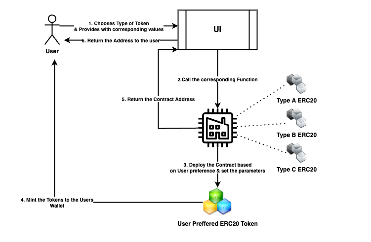

# Capx-Minter
Issuing your own cryptocurrency token on EVM blockchains with One-Click.
Supports Mintable, Pauseable, Capped, Burnable, Reflective and multi Function ERC20 Tokens.

## Architecture


# Deploying the smart contracts
The deployment scripts are written in the [migration files](migrations/) , this project has one primary contract followed by multiple secondary contracts which are the implementations of different types of ERC20 tokens with various features.

## How to deploy a contract in migration files

Normal Deployment
```js
const instanceVariable = await deployer.deploy(contractVariable, contructorArguments)
```
Deployment with proxy
```js
const instanceVariable = await deployProxy(contractVariable, [args], { kind: 'uups' });
```

## Step 1

Importing the contracts

```javascript
const factory = artifacts.require("CapxFactory");
const standardToken = artifacts.require("CapxStandardToken")
.
.
.
const deflationaryToken = artifacts.require("CapxDeflationaryToken");
const autoLPDeflationaryToken = artifacts.require("CapxAutoLPDeflationaryToken");
const superDeflationaryToken = artifacts.require("CapxSuperDeflationaryToken");
```

## Step 2 

Gets the accounts to be used for deployment

```javascript
const accounts = await web3.eth.getAccounts();
```

## Step 3

Deploy CapxStandardToken contract

```javascript
let CapxStandardToken = await standardToken.deployed()
```

## Step 4

Deploys Factory contract with Router address to be used using openzeppelin upgradable plugin. 

```javascript
let CapxFactory = await deployProxy(factory, [standardToken.address, routerAdd], { kind: 'uups' });
```

## Step 5
Deploy other types of token contracts and store addresses.

```javascript
let CapxBurnableToken = await burnableToken.deployed()
.
.
.
let CapxDeflationaryToken = await deflationaryToken.deployed()
let CapxAutoLPDeflationaryToken = await autoLPDeflationaryToken.deployed()
let CapxSuperDeflationaryToken = await superDeflationaryToken.deployed()
```

## Step 6
Implement the deployed contracts in the Factory contract.

```javascript
await CapxFactory.addNewERC20Implementation(
        "Mintable Token",
        CapxMintableToken.address,
        false,
        [true,false,false,false]
    );
.
.
.
await CapxFactory.addNewERC20Implementation(
        "Super Deflationary Token",
        CapxSuperDeflationaryToken.address,
        true,
        [true,true,true,true]
    );
```
### Run Migrate to deploy the contracts.
> truffle migrate

# Implementation Details
## [Factory Contract](contracts/CapxFactory.sol)
The factory contract is responsible mainly for creating new ERC20 tokens , It uses a EIP-1167 implementation to create new ERC20 contracts. For more details see [Factory.md](Factory.md)

## [Other Token Contracts](contracts/)
The other token contracts are the implementations of different types of ERC20 tokens with various features.
